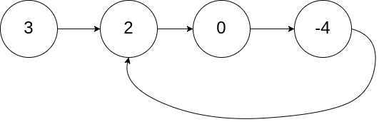

# Problem
Given head, the head of a linked list, determine if the linked list has a cycle in it.
There is a cycle in a linked list if there is some node in the list that can be reached again by continuously following the next pointer. Internally, pos is used to denote the index of the node that tail's next pointer is connected to. Note that pos is not passed as a parameter.
Return true if there is a cycle in the linked list. Otherwise, return false.

(Note: pos is given to show how the linked list is stored, it is NOT passed as parameter)

# Test Case
Input: list = [3,2,0,-4], pos = 1
Output: [3,4,5]
Explanation: 

# Pattern
- Fast and Slow Pointers

# Algorithm
- Start
- Initialise two pointers slow and fast
- Keep looping until fast reaches the end.
- It is of 2 cases: 
    - n is odd: element after fast reaches null
    - n is even: fast reaches null
- Check if slow and fast point to the same node at any situation, if yes return true.
- Else return false outside the loop as they do not meet but reaches the end
- End

# Analogy
Let A run at 10 m/min and B run at 20 m/min in a circular path of distance 30m
Then B will meet A after 60 m, and A will meet B after 30m running, but they eventually meet since it is a circular path

# Mistakes made
- condition check

# Problem Link
https://leetcode.com/problems/linked-list-cycle/description/