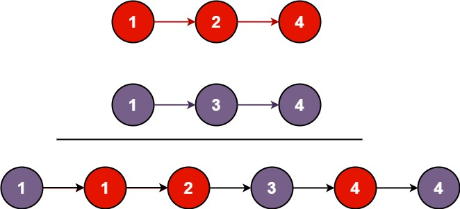

# Problem
You are given the heads of two sorted linked lists list1 and list2.
Merge the two lists into one sorted list. The list should be made by splicing together the nodes of the first two lists.
Return the head of the merged linked list.

# Test Case
Input: list1 = [1,2,4], list2 = [1,3,4]
Output: [1,1,2,3,4,4]
Explanation:

# Pattern
- Dummy node creation
- Pointers

# Algorithm
- Start
- Create a node dummy with value -1 (or 0)
- Create another node tail equal to dummy
- While the nodes of the two list are not null, compare the values at the position
- Update the tail pointer reference as the address of the smallest value
- Also update tail pointer and the list pointer which was updated
- Add the remaining nodes after checking and comparision
- Finally return dummy.next, as we used tail pointer to extend after dummy and it has reached the end. Also, dummy's value is -1, the actual list starts from the node next to dummy.
- End

# Mistakes made
- return value

# Problem Link
https://leetcode.com/problems/merge-two-sorted-lists/