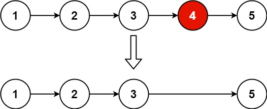
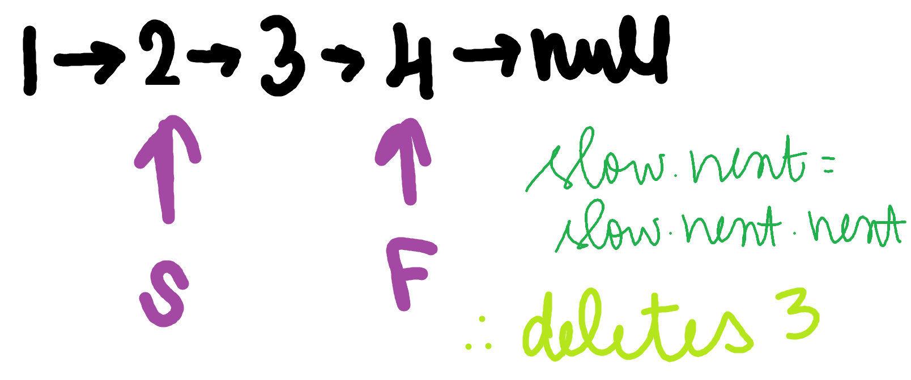

# Problem
Given the head of a linked list, remove the nth node from the end of the list and return its head.

# Test Case
Input: list1 = [1,2,3,4,5], n = 2
Output: [1,2,3,5]
Explanation:

# Pattern
- Dummy node creation
- Two Pointers

# Algorithm
- Start
- Create a node dummy with value -1 (or 0)
- Connect the dummy node with head
- Create two nodes fast and slow and initialise it as dummy
- Now loop till the value of n and keep updating fast = fast.next. This ensures that there is a gap present between the slow and fast pointers with value n by the end of the loop
- Now loop until fast.next is not null (Explanation in dry run)
- Keep updating slow and fast 
- Finally update the address of slow pointer as slow.next.next, thus removing the node to be deleted
- Return dummy.next, as it handles special cases such as n = 1
- End

# Dry run

# Mistakes made
- conditions
- pointer initialisations

# Problem Link
https://leetcode.com/problems/remove-nth-node-from-end-of-list/