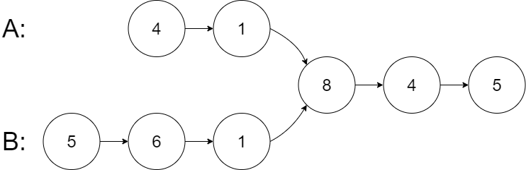

# Problem
Given the heads of two singly linked-lists headA and headB, return the node at which the two lists intersect. If the two linked lists have no intersection at all, return null.

# Test Case
Input: intersectVal = 8, listA = [4,1,8,4,5], listB = [5,6,1,8,4,5], skipA = 2, skipB = 3
Output: Intersected at '8'
Explanation:

# Pattern
- Dummy node creation
- Two Pointers

# Algorithm
- Start
- Create two pointers, a and b, and initialize them to headA and headB respectively.
- Traverse both lists while a is not equal to b.
- During each iteration:
  - If a becomes null, redirect it to headB; otherwise, move it to a.next.
  - If b becomes null, redirect it to headA; otherwise, move it to b.next.
- Continue this process until both pointers become equal.
- If the lists intersect, both pointers will meet at the first common node.
- If the lists do not intersect, both pointers will eventually become null at the same time.
- Return a (or b), as both pointers are equal and represent either the intersection node or null.
- End

# Mistakes made
- concept understanding
- coding

# Problem Link
https://leetcode.com/problems/intersection-of-two-linked-lists/description/