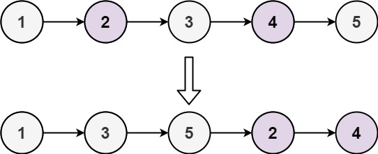

# Problem
Given the head of a singly linked list, group all the nodes with odd indices together followed by the nodes with even indices, and return the reordered list.
The first node is considered odd, and the second node is even, and so on.
Note that the relative order inside both the even and odd groups should remain as it was in the input.
You must solve the problem in O(1) extra space complexity and O(n) time complexity.

# Test Case
Input: [1,2,3,4,5]
Output: [1,3,5,2,4]
Explanation:

# Pattern
- Pointer Concept

# Algorithm
- Start
- Check for edge cases first
- Initialise 3 nodes - odd, even and start which is initialise as even
- We update the even nodes and odd nodes based on even, so the while condition updates on the even nodes
- Now, we first update the odd nodes, which would be the node next to even. Then we move odd to the next node
- We repeat the same process with even node
- Finally we add the start pointer to odd.next, as it denotes the start of the even list and return head
- End

# Mistakes made
- looping conditions
- initialisation
- return value

# Problem Link
https://leetcode.com/problems/odd-even-linked-list/description/