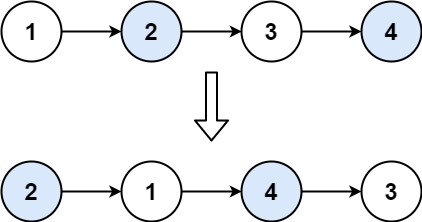

# Problem
Given a linked list, swap every two adjacent nodes and return its head. You must solve the problem without modifying the values in the list's nodes (i.e., only nodes themselves may be changed.)

# Test Case
Input: head = [1,2,3,4]
Output: [2,1,4,3]
Explanation:

# Pattern
- Dummy Node
- Linked List Creation
- Swapping of positions

# Algorithm
- Start
- Create a new linked list dummy, and connect it with the head of the list.
- Initialise a prev node as dummy
- While prev.next & prev.next.next are not null, keep swapping the addresses of elements at that position, and update prev and prev.next using three nodes:
  - first - prev.next
  - second - prev.next.next
  - prev - node before the pair
- End

# Mistakes made
- conditions for swapping

# Problem Link
https://leetcode.com/problems/swap-nodes-in-pairs/