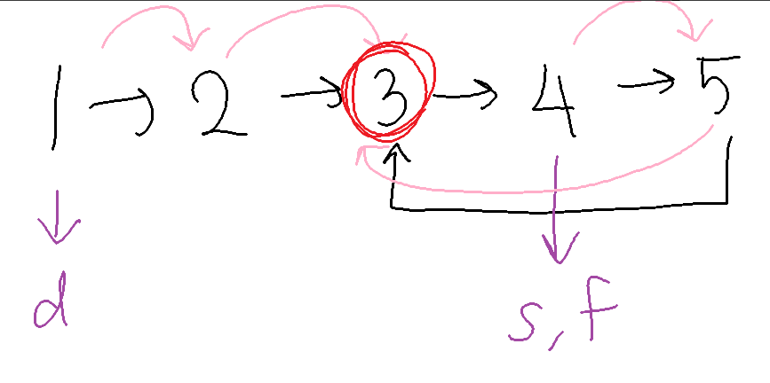

# Problem
Given the head of a linked list, return the node where the cycle begins. If there is no cycle, return null.
There is a cycle in a linked list if there is some node in the list that can be reached again by continuously following the next pointer. Internally, pos is used to denote the index of the node that tail's next pointer is connected to (0-indexed). It is -1 if there is no cycle. Note that pos is not passed as a parameter.
Do not modify the linked list.

# Test Case
Input: list = [3,2,0,-4], pos = 1
Output: tail connects to node index 1

# Pattern
- Cycle Detection
- Floyd's Algorithm

# Algorithm
- Start
- Use two nodes slow and fast
- Use while loop to detect cycle
- Once cycle is detected, create a new node dummy pointing to head
- Now move dummy and slow one by one until both of them are equal, and return the node when it becomes equal (proof of why this works is given in proof.md) (refer dry run for further clarity)
- Outside the loop, return null if cycle is not present.
- End

# Dry Run

# Mistakes made
- return value must not be where cycle was detected, but where cycle starts

# Problem Link
https://leetcode.com/problems/linked-list-cycle-ii/